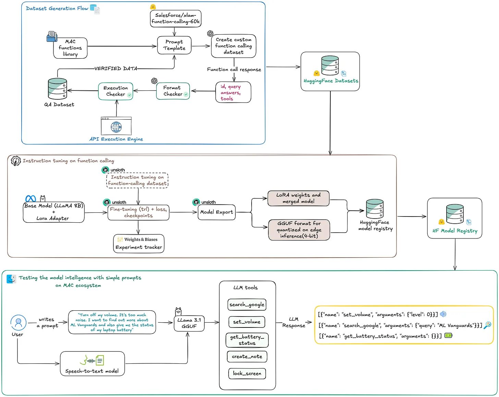

# Build your own Siri

A complete pipeline for building your own Siri-like voice assistant that runs entirely locally. This project includes dataset generation, model fine-tuning, and a real-time inference system with both voice and text input capabilities. This project is the implementation of the solution described in the [4 part course: Build your own Siri, by Hyperplane](https://thehyperplane.substack.com/p/build-your-own-siri-locally-on-device).



## Table of Contents
* [Overview](#overview)
* [Features](#features)
* [Prerequisites](#prerequisites)
* [Installation](#installation)
* [Usage](#usage)
* [Available Functions](#available-functions)
* [Project Structure](#project-structure)
* [Development](#development)
* [License](#license)

## Overview

This project implements a complete pipeline for building a local voice assistant, from dataset generation to model deployment. 

**Dataset Generation Process:**
* Uses Salesforce's xlam-function-calling-60k dataset as few-shot prompt foundation
* Generates fresh, paraphrased examples with human-like responses
* Removes unnecessary data, focusing on quality enhancement
* Creates realistic function-calling scenarios in ShareGPT format

**Model Selection & Training:**
* **Comparative evaluation**: LLaMA 3.1 8B Instruct vs Gemma 2 2B
* **Winner**: LLaMA 3.1 achieved **100% JSON validity and 100% function call accuracy** vs Gemma 2's 70%
* **Fine-tuning strategy**: LoRA (r=16, α=16) with Unsloth for 2-5x faster training
* **Training setup**: 3 epochs, lr=2e-4, batch size 8, W&B logging

**Deployment & Quantization:**
* **Model quantization**: GGUF format with q4_k_m, q5_k_m, q8_0 variants
* **Real-time inference**: Optimized for edge deployment with 4.8GB model size
* **Cross-platform support**: Windows, macOS, Linux compatibility

**Edge integration:(coming soon)**

## Features

* **Complete ML Pipeline**: End-to-end system from dataset generation to model deployment
* **Superior Performance**: 100% JSON validity and function call accuracy with LLaMA 3.1 (vs 70% for Gemma 2)
* **Dual Input Methods**: Voice recording with Whisper STT + text input alternative
* **Optimized Training**: Unsloth integration for 2-5x faster fine-tuning with LoRA
* **Interactive Demo**: Streamlit interface for real-time testing and validation
* **Cross-platform**: Windows, macOS, Linux support with platform-specific optimizations
* **Multiple Model Variants**: q4_k_m (4.8GB), q5_k_m, q8_0 quantized versions
* **Edge deployment**: **Coming soon**

## Key Technical Achievements

**Model Evaluation Results:**
* **LLaMA 3.1 8B**: 100% JSON validity, 100% function call accuracy
* **Gemma 2 2B**: 70% JSON validity, 70% function call accuracy
* **Dataset Quality**: Custom dataset based on Salesforce's xlam-function-calling-60k
* **Training Efficiency**: 3 epochs with LoRA fine-tuning using Unsloth optimization

**Architecture Highlights:**
* **LoRA Configuration**: rank=16, alpha=16, targeting attention and MLP layers
* **Training Setup**: batch_size=8, lr=2e-4, gradient_accumulation_steps=2
* **Quantization Strategy**: Multiple GGUF variants for different hardware constraints
* **Real-world Validation**: Streamlit interface for comprehensive testing

## Prerequisites

* Python 3.12 or higher
* uv (for dependency management)
* CUDA-capable GPU (recommended for training)
* Microphone for voice input
* 8GB+ RAM

## Installation

### Local Development Setup

1. Clone the repository:
```bash
git clone https://github.com/yourusername/custom-siri.git
cd custom-siri
```

2. Install dependencies:
```bash
uv sync
```

3. Activate virtual environment:
```bash
source .venv/bin/activate  # On Windows: .venv\Scripts\activate
```

## Usage

### Running the Streamlit App

```bash
streamlit run app.py
```

The application will be available at `http://localhost:8501`

## Docker Setup
Build and run using Docker:

```bash
docker build -t custom-siri .
docker run -p 8501:8501 --rm custom-siri \
```

### Example Commands

**Voice/Text Input:**
* *"Set the volume to 50 and search for Python tutorials"*
* *"Take a screenshot and create a folder called Projects"*
* *"Open Chrome and show me the battery status"*
* *"Lock the screen and pause the music"*

## Available Functions

### File Operations
* `copy_file`, `move_file`, `delete_file`, `create_folder`

### System Control
* `open_application`, `close_application`, `take_screenshot`, `lock_screen`, `get_battery_status`, `set_volume`

### Web & Media
* `open_url`, `search_google`, `play_music`, `pause_music`

### Productivity
* `create_note`

## Project Structure

```
custom-siri/
├── src/
│   ├── streamlit_siri_demo/   # Streamlit web demo
│   ├── functions/             # Function implementations
│   ├── dataset/               # Dataset generation tools
│   └── models/               # Trained model files
├── experiments/              # Experiment scripts
├── Dockerfile                # For using docker containers
├── notebook/                # Training notebooks
├── app.py                   # Main Streamlit application
├── functions.py             # Core function library
├── pyproject.toml          # Project configuration
└── README.md
```

## Development

### Key Dependencies
* **torch** (2.7+) - Deep learning framework
* **faster-whisper** - Speech-to-text processing
* **llama-cpp-python** - Local LLM inference
* **streamlit** - Web interface
* **sounddevice** - Audio recording
* **unsloth** - Efficient model fine-tuning

### Model Training Pipeline

The complete training pipeline is available in the Jupyter notebook and includes:

1. **Dataset Preparation**: Using custome Siri function-calling dataset
2. **Model Fine-tuning**: LoRA adaptation of Llama 3.1 8B
3. **Quantization**: GGUF format for efficient inference
4. **Evaluation**: 100% accuracy validation

### Adding New Functions

1. Implement functions in `functions.py`
2. Add schema to `functions` list
3. Register in `available_function_calls` dictionary

## License

This project is licensed under the MIT License - see the LICENSE file for details.

---

**All courses, along with the generated date and fine-tuned model locations.**
* [Part 1: Build your own Siri. Locally. On-Device. No Cloud.](https://thehyperplane.substack.com/p/data-preparation-for-function-tooling)  
* [Part 2: Data Preparation for Function Tooling is boring ](https://thehyperplane.substack.com/p/data-preparation-for-function-tooling)
* [Part 3: Fine tuning is boring](https://thehyperplane.substack.com/p/data-preparation-for-function-tooling)
* [Part 4: Siri on Edge](https://thehyperplane.substack.com/p/build-your-own-siri-locally-on-device)
* [Custom Datasets](https://huggingface.co/datasets/valex95/)
* [Fine-tuned Models](https://huggingface.co/CosminMihai02/)